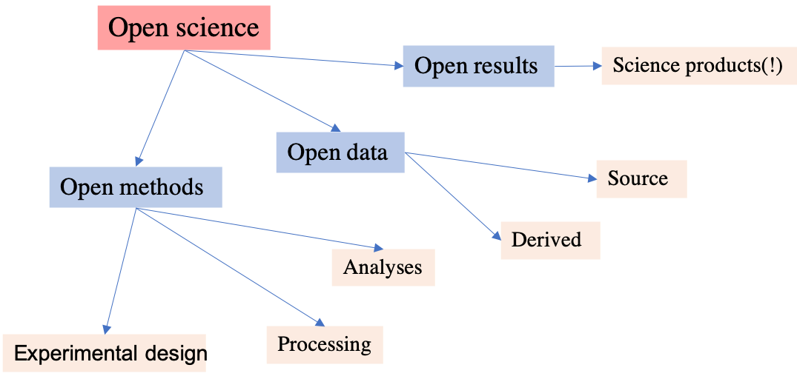
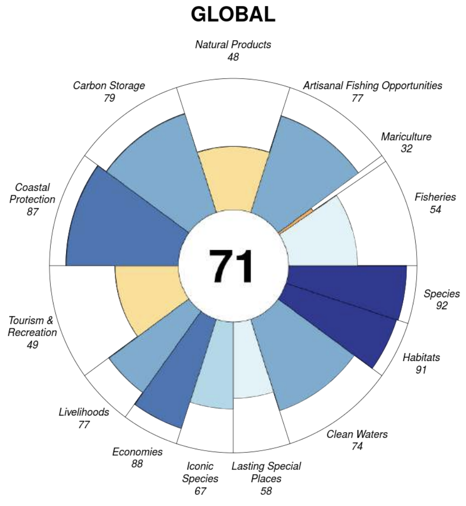
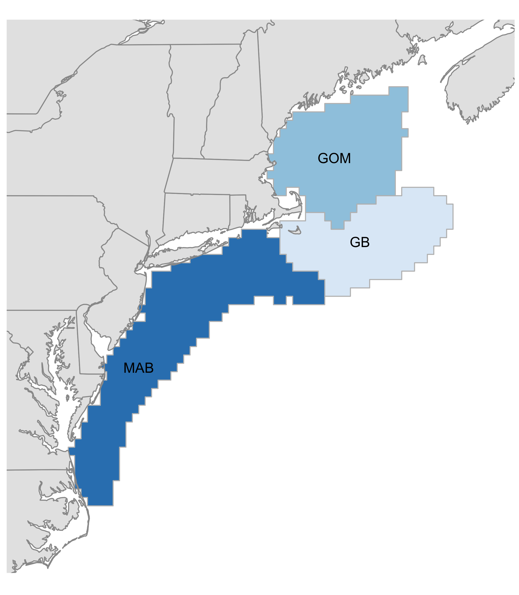
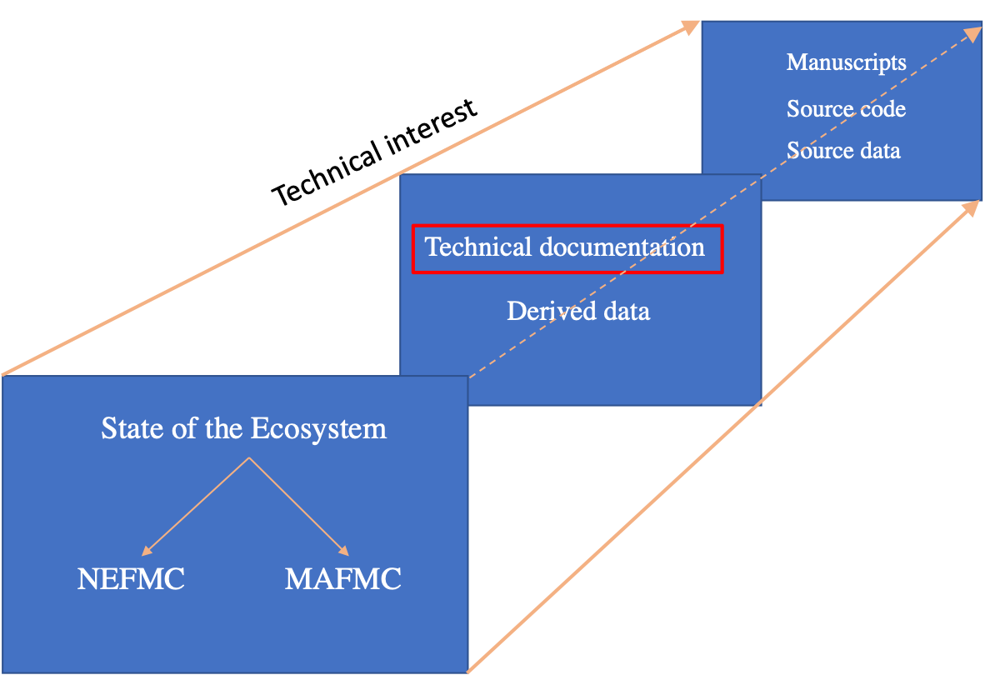
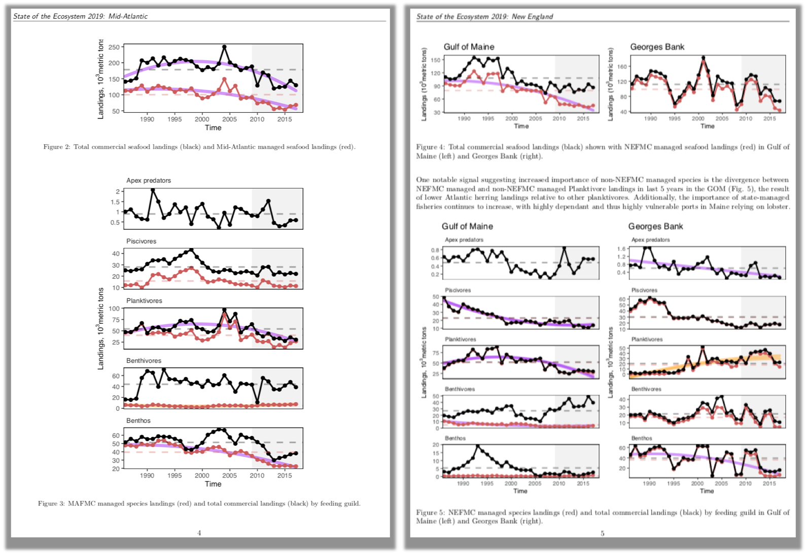
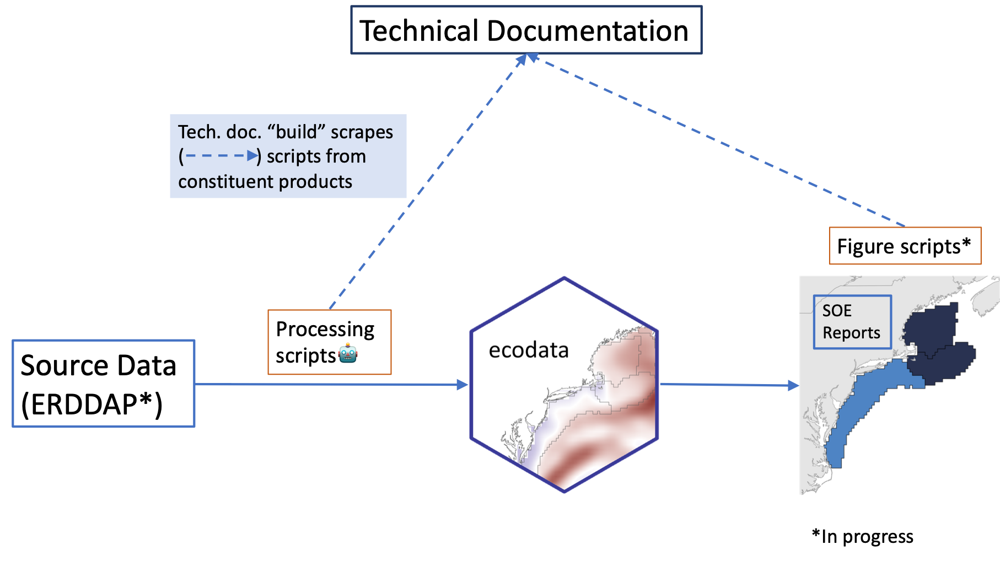
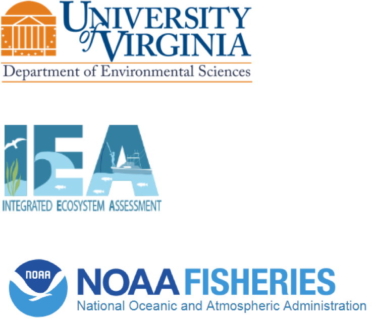

```{r, echo = F, message = F, warning = F}
library(tidyverse)
library(sf)
library(ggrepel)
## General mapping parameters
xmin = -77
xmax = -65
ymin = 35
ymax = 45

xlims <- c(xmin, xmax)
ylims <- c(ymin, ymax)
crs <-  "+proj=longlat +datum=WGS84 +no_defs +ellps=WGS84 +towgs84=0,0,0" 

## 2) North America layer
ne_countries <- rnaturalearth::ne_countries(scale = 10,
                                            continent = "North America",
                                            returnclass = "sf") %>% 
  sf::st_transform(crs = crs)

## 3) State layer
ne_states <- rnaturalearth::ne_states(country = "united states of america",
                                      returnclass = "sf") %>% 
  sf::st_transform(crs = crs)

epu_sf <- st_read(here::here("data/EPU_NO_ESTUARIES"), quiet = T) %>%
  st_transform(crs = crs) %>% filter(EPU != "SS") 


```

background-image: url("images/open-iea-slide-bg.png")
background-size: cover

# Defining open science

"...free and unfettered access to all stages of the scientific endeavor" - *Hampton et al. 2015*

```{r, echo = F}

```

.right-column[
.footnote[
Hampton, Stephanie E., et al. "The Tao of open science for ecology." Ecosphere 6.7 (2015): 1-13.
]
]
???
In the 2015 paper aptly named the Tao of Open Science for Ecology, Hampton et al. suggest that it's the free and unfettered access to all stages of the scientific endeavor. 

This includes the methods use in design of experiements, the source and derived data sets from which inferences were made, and also the provenance of data sets through processing and analysis stages. These tools help scientists and interested stakeholders understand how we came to the conclusions we did given the data we had. Further, while less important for the examples I'll be discussing today, a key aspect of open science is that the final products themselves be made freely available. 

---
background-image: url("images/open-iea-slide-bg.png")
background-size: cover

# Open data science in action: Ocean Health Index

Framework for assessing marine ecosystem health from local to global scales<sup>1</sup> 

```{r, echo = F, message = F, fig.align = "center", out.width = "35%"}

```

--

Leveraging open data science tools<sup>2</sup> 
* Modular, programmatic workflows to scale projects
* Open science to ensure transparency, reproducibility, and repeatability
 
 
.footnote[
Lowndes, Julia S. Stewart, et al. "Best practices for assessing ocean health in multiple contexts using tailorable frameworks." PeerJ 3 (2015): e1503.

Lowndes, Julia S. Stewart, et al. "Our path to better science in less time using open data science tools." Nature ecology & evolution 1.6 (2017): 0160.
]

???
An important

The Ocean Health Index uses a standard framework for assessing the health of marine ecosystems around the world. 

Ecosystem health is based on goals developed in partnership with local experts and stakeholders

---

background-image: url("images/open-iea-slide-bg.png")
background-size: cover

# Ecosystem reporting in the Northeast Shelf IEA Region

.pull-left[
Two major State of the Ecosystem (SOE) documents annually 
* Mid-Atlantic Fishery Management Council (MAFMC) and	New England Fishery Management Council (NEFMC)

*	Syntheses of ecosystem information to provide best understanding of links to management objectives

* &gt; 400 data sets submitted for New England document; filtered/aggregated to ~30
]

.pull-right[
```{r, echo = F, warning = F}
# (map <- ggplot() +
#     geom_sf(data = epu_sf, aes(fill = EPU), color = "grey") +
#       geom_text(data = epu_sf,
#     aes(label = EPU, geometry = geometry),
#     stat = "sf_coordinates",
#     color = "black",
#     size = 5) +
#     scale_fill_brewer("blues") +
#     guides(fill = F) +
#     ggplot2::geom_sf(data = ne_countries, color = "grey60", size = 0.5) +
#     ggplot2::geom_sf(data = ne_states, color = "grey60", size = 0.5) +
#     ggplot2::coord_sf(crs = crs, xlim = xlims, ylim = ylims) +
#     ggthemes::theme_map() +
#     ggplot2::theme(plot.background = element_rect(fill = "transparent",colour = NA),
#                    rect = element_rect(fill = "transparent")))
# 
# ggsave(map, file = "images/epu_map.png"), bg = "transparent")

```
]


---
background-image: url("images/nes-components.png")
background-size: cover

???
The many interacting components in integrated ecosystem assessments and the subset of ecosystem reporting present several challenges that we think can be efficiently addressed using open data science tools. 


---
background-image: url("images/open-iea-slide-bg.png")
background-size: cover

# Challenges for NE-IEA ecosystem reporting

.text-highlight[
External
]

* Audience with wide array of background and scientific training
    * No capacity to produce documents across the spectrum of end-user needs
      
* Managing the workload under FMC deadlines

--

.text-highlight[
Internal
]

* Data hosting and documentation
  
* Keeping collaborators engaged
    
* Ensuring collaborators feel their work is valued
    
* Adding new information to reports
    
---
background-image: url("images/open-iea-slide-bg.png")
background-size: cover

# Open science for meeting end-user needs

**How to address variability in user interests?**

--

Start from the highest conceptual level while making technical information freely available

.pull-left[

```{r, echo = F, out.width = "100%", fig.align = "center"}

```

]

.pull-right[
```{r, echo = F, out.width = "100%", fig.align = "center"}
knitr::include_graphics("images/tech-doc-gif.gif")
```
]

Metadata and further resources made accessible through an online technical report

---
background-image: url("images/open-iea-slide-bg.png")
background-size: cover

# Programmatic efficiencies to manage workloads 

**Ecosystem reports can be modular and automated (to a certain extent)**

1) SOE data are aggregated into the **ecodata R package**

.center[

]


---
background-image: url("images/open-iea-slide-bg.png")
background-size: cover

# Programmatic efficiencies to manage workloads

**Ecosystem reports can be modular and automated (to a certain extent)**

2) SOE reports are written as Rmarkdown documents, making use of the ecodata package.

3) Data are processed and structures are the same, meaning (very similar) figure code can be applied across projects.

```{r, echo = F, fig.align = "center", out.width = "75%"}

```

---
background-image: url("images/open-iea-slide-bg.png")
background-size: cover

# Managing data provenance

Leveraging Travis CI, a **continuous integration** software, with Github and Rmarkdown documents

```{r, echo = F}

```

SOE reports, ecodata, and technical documentation hosted on Github

???
With data from so many different sources, ensuring that the processing and analytical steps taken to move from source data to derived product are open and easy to follow is difficult. 

To address this challenge, we linked processing code from our ecodata package to our technical documentation, so that anytime our processing code is updated, it's automatically scraped into the technical document. This process ensures that provenance on our end is up to date.

---
background-image: url("images/open-iea-slide-bg.png")
background-size: cover

# Collaborator engagement

* SOE products are iterative, continued collaborator engagement is critical

* .text-highlight[DOIs for data sets and documents] (ongoing, but challenging for government channels)

* .text-highlight[Promotion of collaborations] through public-facing products and social media

* .text-highlight[Workshops] allowing for scientists to discuss science outside IEA

```{r, echo = F, fig.align = 'center', out.width="40%"}
knitr::include_graphics(here::here("images/iea-loop.png"))
```

---
background-image: url("images/open-iea-slide-bg.png")
background-size: cover

# Conclusions and lessons learned

* A network of dependent products related to ecosystem reporting has increased the communication, transparency, and reproducibility of our documents. 

* Management and collaborators find accessibility to be a major improvement

* Check out open science skills workshops for your team

--

.box-highlight[
* Embracing open data science techniques is an iterative process

    * It will be difficult
    * There is a steep learning curve
    * It will be worth it! 
]

---
background-image: url("images/open-iea-slide-bg.png")
background-size: cover

# Thank you!


.pull-left[

## Northeast Fisheries Science Center

Sarah Gaichas (EDAB)</br>
Sean Lucey (EDAB)</br>
Scott Large (EDAB)</br>
Andy Beet (EDAB)</br>
Kimberly Hyde (EDAB)</br>
Kevin Friedland (EDAB)</br>
Laurel Smith (EDAB)</br>
Geret DePiper (SSB)</br>
Charles Peretti (PDB)</br>
Kimberly Bastille (EDAB)</br>
Robert Gamble (EDAB)</br>

]

.pull-right[
```{r, echo = F}

```
]

Explore our work at https://github.com/noaa-edab
